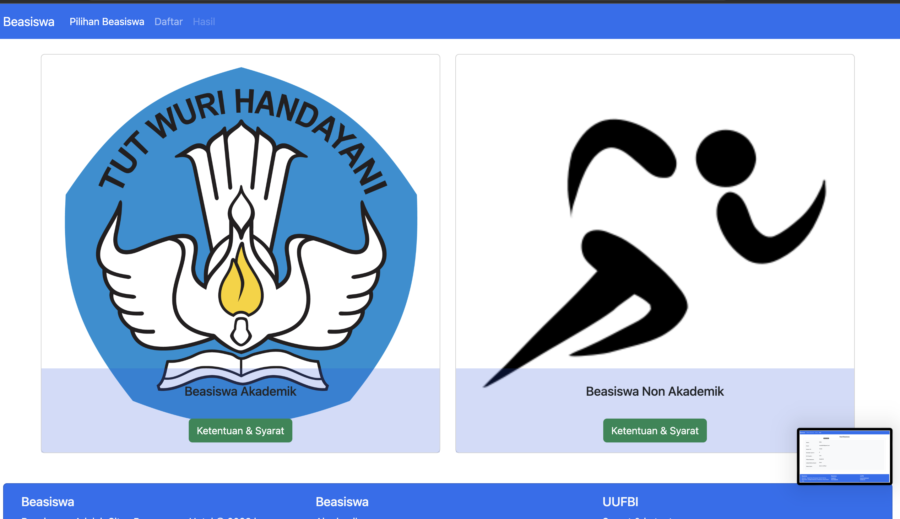
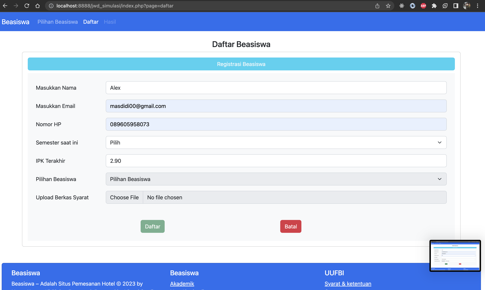
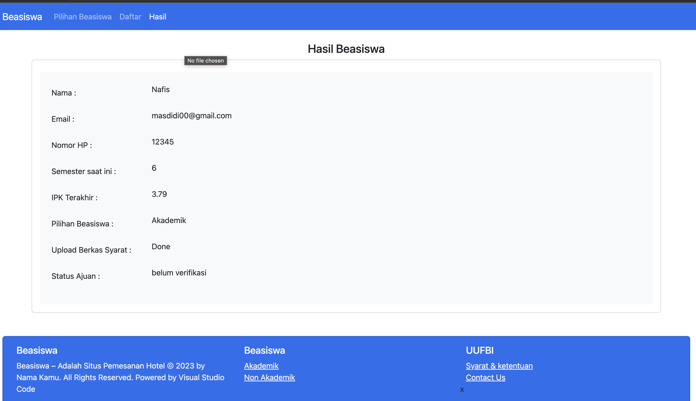
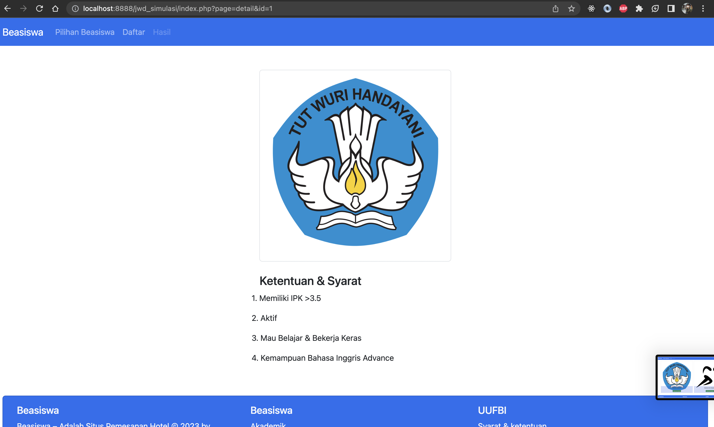

# WEB Daftar Beasiswa

## Struktur Hierarki Project
<pre>
.
├── ./README.md
├── ./api
│   ├── ./api/checkDataBeasiswa.php
│   └── ./api/getMahasiswa.php
├── ./config
│   └── ./config/connect.php
├── ./constant.php
├── ./function.php
├── ./index.php
├── ./jwd_simulasi.sql
├── ./layout
│   ├── ./layout/footer.php
│   └── ./layout/header.php
├── ./pages
│   ├── ./pages/404.php
│   ├── ./pages/actionSubmit.php
│   ├── ./pages/daftar.php
│   ├── ./pages/detail.php
│   ├── ./pages/hasil.php
│   └── ./pages/home.php
└── ./src
    ├── ./src/css
    │   ├── ./src/css/bootstrap-grid.css
    │   ├── ./src/css/bootstrap-grid.css.map
    │   ├── ./src/css/bootstrap-grid.min.css
    │   ├── ./src/css/bootstrap-grid.min.css.map
    │   ├── ./src/css/bootstrap-grid.rtl.css
    │   ├── ./src/css/bootstrap-grid.rtl.css.map
    │   ├── ./src/css/bootstrap-grid.rtl.min.css
    │   ├── ./src/css/bootstrap-grid.rtl.min.css.map
    │   ├── ./src/css/bootstrap-reboot.css
    │   ├── ./src/css/bootstrap-reboot.css.map
    │   ├── ./src/css/bootstrap-reboot.min.css
    │   ├── ./src/css/bootstrap-reboot.min.css.map
    │   ├── ./src/css/bootstrap-reboot.rtl.css
    │   ├── ./src/css/bootstrap-reboot.rtl.css.map
    │   ├── ./src/css/bootstrap-reboot.rtl.min.css
    │   ├── ./src/css/bootstrap-reboot.rtl.min.css.map
    │   ├── ./src/css/bootstrap-utilities.css
    │   ├── ./src/css/bootstrap-utilities.css.map
    │   ├── ./src/css/bootstrap-utilities.min.css
    │   ├── ./src/css/bootstrap-utilities.min.css.map
    │   ├── ./src/css/bootstrap-utilities.rtl.css
    │   ├── ./src/css/bootstrap-utilities.rtl.css.map
    │   ├── ./src/css/bootstrap-utilities.rtl.min.css
    │   ├── ./src/css/bootstrap-utilities.rtl.min.css.map
    │   ├── ./src/css/bootstrap.css
    │   ├── ./src/css/bootstrap.css.map
    │   ├── ./src/css/bootstrap.min.css
    │   ├── ./src/css/bootstrap.min.css.map
    │   ├── ./src/css/bootstrap.rtl.css
    │   ├── ./src/css/bootstrap.rtl.css.map
    │   ├── ./src/css/bootstrap.rtl.min.css
    │   ├── ./src/css/bootstrap.rtl.min.css.map
    │   └── ./src/css/style.css
    ├── ./src/image
    │   ├── ./src/image/Screen Shot 2023-02-19 at 23.23.49.png
    │   ├── ./src/image/Screen Shot 2023-02-19 at 23.24.48.png
    │   ├── ./src/image/Screen Shot 2023-02-22 at 01.38.47.png
    │   ├── ./src/image/Screen Shot 2023-02-22 at 01.54.32.png
    │   ├── ./src/image/Screen Shot 2023-02-22 at 08.05.40.png
    │   ├── ./src/image/Screen Shot 2023-03-19 at 20.42.21.png
    │   ├── ./src/image/beasiswa_akademik.png
    │   ├── ./src/image/d6f8f-04_fr.ia.02-tugas-praktik-demonstrasi_v3-esron.pdf
    │   └── ./src/image/non_akademik.png
    └── ./src/js
        ├── ./src/js/bootstrap.bundle.js
        ├── ./src/js/bootstrap.bundle.js.map
        ├── ./src/js/bootstrap.bundle.min.js
        ├── ./src/js/bootstrap.bundle.min.js.map
        ├── ./src/js/bootstrap.esm.js
        ├── ./src/js/bootstrap.esm.js.map
        ├── ./src/js/bootstrap.esm.min.js
        ├── ./src/js/bootstrap.esm.min.js.map
        ├── ./src/js/bootstrap.js
        ├── ./src/js/bootstrap.js.map
        ├── ./src/js/bootstrap.min.js
        ├── ./src/js/bootstrap.min.js.map
        └── ./src/js/script.js
</pre>

## Tools 
* Visual Studio code
* Xampp 

## Language
* PHP 
* Mysql

## Output
 * Homepage
  
* Daftar
 
* Hasil
 
* Detail
 

 ## INSTALASI
 * Buat database namadb bebas
 * Impor jwd_simulasi.sql ke dalam namadb tersebut

 ## Tips
 * Semua variabel dirapihkan dalam fungsi function.php silahkan cek semua logic query di dalam function.php